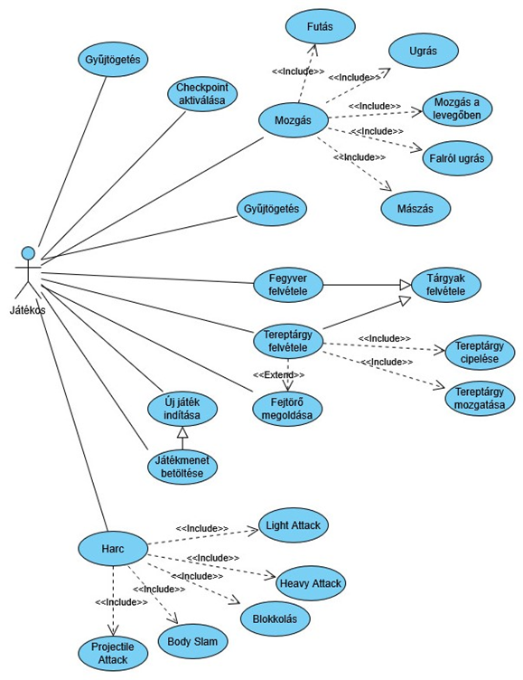
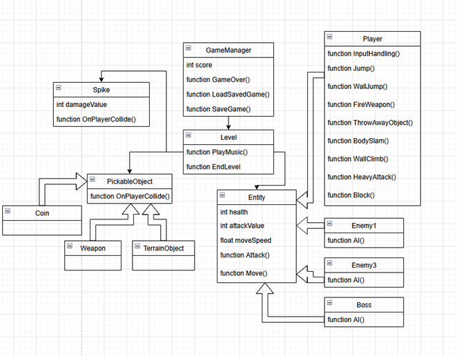
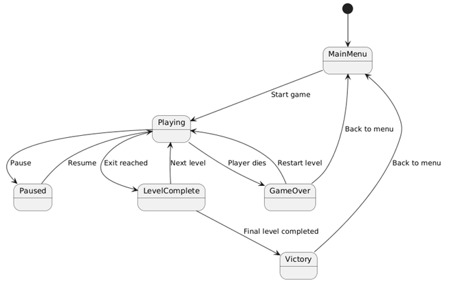
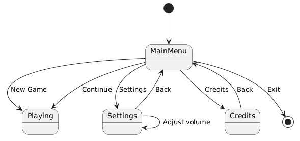
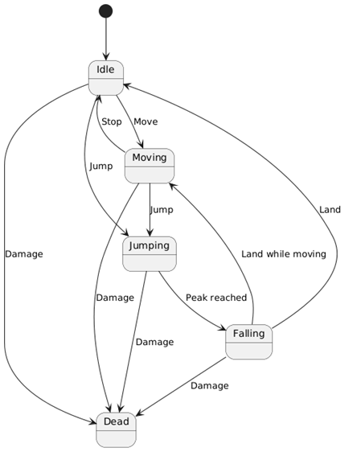
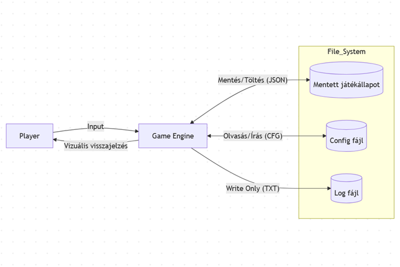

# Capy-barangolás
Modern szoftverfejlesztési eszközök - GKNB_INTM129

Copybara csapat: 
- Zsédely Péter
- Csikai Valér Zsolt
- Varga László
- Horváth Máté

## Tartalomjegyzék

1. [Alapinformációk](#1-alapinformációk)
2. [Történetvázlat](#2-történetvázlat)
3. [Követelmények](#3-követelmények)
4. [Használati esetek](#4-használati-esetek)
5. [Struktúra](#5-struktúra)
   - [Scene-ek és Prefab-ek](#51-scene-ek-és-prefab-ek)
6. [Program viselkedésének modellezése](#6-program-viselkedésének-modellezése)
   - [A játék állapotgépének leírása](#61-a-játék-állapotgépének-leírása)
   - [A főmenü állapotgépének leírása](#62-a-főmenü-állapotgépének-leírása)
   - [A játékos állapotgépének leírása](#63-a-játékos-állapotgépének-leírása)
7. [Tesztelés](#7-tesztelés)
8. [Adatfolyam diagram](#8-adatfolyam-diagram)
9. [Fejlesztési eszközök](#9-fejlesztési-eszközök)

## 1. Alapinformációk

Ez a specifikáció egy 2D oldalnézetes platformer játékhoz készült. A játék főhőse egy kapibara, amely különböző pályákon keresztül próbál kijutni egy veszélyes területről. A játékos billentyűzettel irányítja a karaktert, ugrál platformokon, kikerüli az akadályokat és elkerüli vagy legyőzi az ellenségeket. A pályákon egyszerű puzzle-elemek és különböző akadályok nehezítik a haladást. A játék három pályából áll, amelyek nehézsége fokozatosan növekszik.

## 2. Történetvázlat

Egy békés napon egy kapibara család a folyópart közelében pihen az élőhelyén. A környék nyugodt és biztonságos, azonban egy váratlan esemény miatt a kicsinyek szétszóródnak a környező területeken. A főhős kapibara feladata, hogy elinduljon, megkeresse elveszett kicsinyeit, majd együtt visszatérjen a biztonságos élőhelyükre.

Az út során a kapibarának több különböző környezeten kell áthaladnia. A kaland egy sűrű erdőben kezdődik, ahol a sűrű növényzet, mély szakadékok és ellenséges állatok nehezítik az előrehaladást. A későbbi pályákon a környezet változhat: a kapibara áthaladhat dzsungeles területeken, szárazabb sivatagos vidékeken vagy akár hidegebb, havas régiókon is. Minden terület saját akadályokat és veszélyeket tartalmaz, amelyek próbára teszik a játékos ügyességét.

A játékos feladata, hogy a kapibarát irányítva platformokon ugrálva, akadályokat kikerülve és ellenségeket elkerülve vagy legyőzve megtalálja a pályákon elszórtan található kicsinyeket és egyéb gyűjthető tárgyakat. Egyes területeken különböző tárgyak segíthetik a továbbhaladást, például kulcsok vagy egyéb eszközök, amelyek új utakat nyithatnak meg. A pályákon elhelyezett checkpointok lehetővé teszik, hogy a kapibara halál esetén a legutóbb elért biztonságos pontról folytassa az utat.

Miután a kapibara összegyűjtötte az összes kicsinyét és sikeresen áthaladt az összes veszélyes területen, a család végül visszatér az eredeti élőhelyére a folyóparton. Ezzel a történet lezárul, és a játék sikeresen befejeződik.

## 3. Követelmények

| Azonosító | Megnevezés | Leírás | Prioritás |
|---|---|---|---|
| R1 | Pálya megjelenítése | A játék legyen képes megjeleníteni a pályákon lévő objektumokat (pl.: főhős, ellenség, tárgyak) | Magas |
| R2 | Játék mentése | A játék legyen képes az adott játékmenet állapotának mentésére. | Magas |
| R3 | Játék betöltése | A játék legyen képes betölteni a játékmenetet mentésből. | Magas |
| R4 | Azonos játékmenet | Betöltés után a játékmenet állapota egyezzen meg a játékmenet mentés pillanatában meglévő állapotával. | Magas |
| R5 | Checkpoint rendszer | A pályán legyenek checkpointok elhelyezve, amiket a főhős tud aktiválni. A legutolsó aktivált checkpoint szolgáljon kiindulópontként. | Magas |
| R6 | Mentés | A játék mentsen mikor egy checkpoint aktiválódott | Magas |
| R7 | Hangeffektek és zene | A játék legyen képes futás során zenét és hangeffekteket lejátszani a pályán lévő objektumok viselkedésétől függően. | Közepes |
| R8 | Hangbeállítások | A játékos legyen képes egy menüben a zene és a hangeffektek hangerejének beállítására | Alacsony |
| R9 | Harc | A főhős tudjon harcolni | Magas |
| R10 | Ellenfelek | A játékban legyenek ellenfelek, akik a főhős halálát akarják okozni és akikkel a főhős harcolhat. | Magas |
| R11 | Platformok | A pályán legyen olyan terep, amin a főhős tud mozogni | Magas |
| R12 | Mozgás | A játékos legyen képes a főhős mozgatására | Magas |
| R13 | Akadályok | Legyenek olyan elemei a terepnek, amik a játékos előrehaladását nehezítik és/vagy a főhős halálát okozzák. | Magas |
| R14 | Életerő | A főhősnek és az ellenfeleknek van életereje, ami csökkenthető és növelhető. Ha teljesen lecsökken, a főhős/ellenség meghal | Magas |
| R15 | Halál | Ha a főhős meghal, a játékosnak az utolsó aktivált checkpointtól kell folytatnia a játékot. | Magas |

**Table 1.: Követelmények**

## 4. Használati esetek

| Azonosító | Megnevezés | Leírás | Prioritás |
|---|---|---|---|
| U1 | Mozgás | A játékos különböző módokon mozgatja a főhőst. | Magas |
| U1.1 | Futás | A főhős fut jobbra-balra | Magas |
| U1.2 | Ugrás | A főhős a levegőbe ugrik, majd visszaesik a terepre | Magas |
| U1.3 | Mozgás a levegőben | Ameddig a főhős a levegőben van képes jobbra-balra mozogni | Magas |
| U1.4 | Falról ugrás | Amennyiben a főhős a levegőben mozog a fal felé és a fal mellett van, az ellentétes irányba ugrik | Magas |
| U1.5 | Mászás | Amennyiben megfelelő terep mellett van a főhős, fel-le mászik | Magas |
| U2 | Checkpoint aktiválása | A játékos aktiválja a checkpoint-ot | Magas |
| U3 | Harc | A játékos különböző módokon harcol az ellenfelekkel | Magas |
| U3.1 | Light Attack | A játékos megnyomja a támadó gombot, mire a főhős maga elé suhint a fegyverével, megsebezve az előtte álló ellenfelet. | Magas |
| U3.2 | Heavy Attack | A játékos nyomva tartja majd elengedi a támadó gombot, mire a főhős maga elé suhint a fegyverével, megsebezve az előtte álló ellenfelet. | Magas |
| U3.3 | Blokkolás | A játékos nyomva tartja a blokkoló gombot, eközben a főhős védekezik. Ekkor az ellenség nem tudja szemből megsebezni. | Magas |
| U3.4 | Projectile Attack | A játékos megnyomja a tüzelő gombot mire a főhős tüzel a távolsági fegyverével. | Közepes |
| U3.5 | Body Slam | A főhős megnyomja a támadó gombot és a főhős a levegőben van; ekkor a főhős lezuhan és a terepre érve megsebzi a mellette lévő ellenfeleket. | Közepes |
| U4 | Tárgyak felvétele | A főhős felszedi a terepen lévő tárgyat. | Magas |
| U4.1 | Fegyver felvétele | A főhős felvesz egy fegyvert ami a jelenlegi távolsági fegyverévé válik. | Közepes |
| U4.2 | Tereptárgy felvétele | A főhős felvesz egy tereptárgyat amit a kezében tart. | Közepes |
| U4.3 | Tereptárgy cipelése | A főhős mozgás közben magával viszi a tárgyat. | Közepes |
| U4.4 | Tereptárgy lerakása | A főhős lerakja a tereptárgyat | Közepes |
| U5 | Gyűjtögetés | A főhős, elhaladván az összegyűjthető objektum mellett, összeszedi azt | Közepes |
| U6 | Új játék indítása | A játékos elindít egy új játékmenetet. | Magas |
| U6.1 | Játékmenet betöltése | A játékos betölt egy mentett játékmenetet. | Magas |
| U7 | Hangerő módosítása | A játékos módosítja a zene és/vagy a hangeffektek hangerejét | Alacsony |
| U8 | Fejtörő megoldása | A játékos megoldja a fejtörőt a továbbhaladáshoz | Közepes |
| U9 | Pálya teljesítése | A játékos eléri az pálya végét, majd folytatja a játékot a következő pályával | Magas |
| U9.1 | Játék teljesítése | A játékos teljesíti az utolsó pályát | Magas |

**Table 2: Használati esetek**

**Figure 1: Functional Use Cases**

## 5. Struktúra

**Figure 2: Struktúra diagram**

### 5.1 Scene-ek és Prefab-ek

**Prefab Gamemanger** - Ez tárolja el a szintek között megmaradó adatokat, mint a pontszámot, és kezeli a mentéseket, a szintek közti átmenetet

**Scene Level** - A világ, amelyben elhelyezzük a Prefab-eket, háttérral, földdel, zenével

**Prefab Spike** - valamilyen tüske/akadály, amihez ha a játékos hozzáér, életet veszít

**Prefab Entity** - A játékos és az ellenséges karaktereket származtatjuk ebből, rendelkezik élettel, valamilyen mozgással és támadással. Ha elfogy az életük, akkor elpusztulnak

**Prefab Player** - A játékos által irányított karakter, hozzáadjuk az input kezelést, valamint a pályákon elszórt különféle dolgok felszedését, lerakását, a falakon fel tud mászni, és sok extra módon tud támadni a többi ellenséghez képest

**Ellenséges Prefab-ek** - ezekhez valamilyen AI-t adunk hozzá, hogy legyenek képesek reagálni a játékosra, felé mozogni és azt támadni

**Prefab Enemy1** - legegyszerűbb ellenség, csak földön tud mozogni és ütni, ha közel a játékos

**Prefab Enemy2** - messziről próbál a játékos irányába lőni

**Prefab Enemy3** - több élettel rendelkező, lassú és nagy ellenség, közelről próbál megütni

**Prefab Boss** - A harmadik map végén található utolsó ellenség, ezt legyőzve véget ér a játék, rengeteg élettel és többféle támadással

**Prefab Coin** - A játékos összegyűjti azzal, hogy a közelébe megy, ezzel növelve a pontszámát

## 6. Program viselkedésének modellezése

**Figure 3: Game State Machine**

**Figure 4: Main Menu State Machine**

**Figure 5: Player State Diagram**

### 6.1 A játék állapotgépének leírása

A játék a főmenü állapotból indul, ahol a játékos elindíthatja a játékot. Ekkor a program játék közben állapotba kerül. Ebben az állapotban a játékos irányíthatja a karaktert, haladhat a pályán, akadályokat kerülhet ki, valamint ellenségekkel találkozhat. A játék bármikor szüneteltethető, ekkor a program szünet állapotba lép, ahonnan folytatható a játék. Ha a játékos eléri a pálya végét, a program pálya teljesítve állapotba kerül. Innen vagy a következő pálya indul el, vagy ha ez volt az utolsó pálya, a játék győzelem állapotba vált. Ha a játékos elveszíti az összes életét vagy meghal, a program játék vége állapotba kerül, ahonnan a pálya újraindítható, vagy vissza lehet térni a főmenübe.

### 6.2 A főmenü állapotgépének leírása

A program indulásakor a rendszer a főmenü állapotba kerül. Ebben az állapotban a felhasználó több lehetőség közül választhat. A New Game opció kiválasztásával új játék indul, és a rendszer a játék állapotába lép. A Continue opció egy korábban mentett játék betöltését teszi lehetővé, amely után a játékmenet szintén a játék állapotban folytatódik. A Settings menüpont kiválasztásával a felhasználó a beállítások menübe jut, ahol módosíthatja a játék hangerejét, és visszatérhet a főmenübe. A Credits menüpont a játék készítőinek listáját jeleníti meg, ahonnan szintén vissza lehet térni a főmenübe. Az Exit opció kiválasztásával a program bezárul.

### 6.3 A játékos állapotgépének leírása

A játékos alapállapota az idle állapot, amikor a karakter nem mozog. Ha a játékos mozgásra vonatkozó billentyűt nyom meg, a karakter mozgás állapotba kerül. Ha a mozgás megszűnik, a karakter visszatér az idle állapotba. Ugrás hatására a karakter ugrás állapotba kerül, majd amikor elveszíti a felfelé irányuló mozgását, esés állapotba vált. Földet érés után a karakter vagy visszatér nyugalmi állapotba, vagy mozgás esetén ismét futás állapotba kerül. Ha a karakter olyan ellenséggel vagy akadállyal kerül kapcsolatba, amely halált okoz, akkor halott állapotba kerül. Ez az állapot jelzi, hogy a játékos karakter már nem irányítható, és a játék a játék vége állapot felé halad.

## 7. Tesztelés

A tesztelés a Unity Framework-kel történik. Ez a keretrendszer magába a Unity engine-be van beépítve, segítségével tesztelhetjük a kódunkat és így a játékot. Ez az eszköz az egyébként .NET-re fókuszáló NUnit framework bővítése.

## 8. Adatfolyam diagram

**Figure 6: Adatfolyam diagram**

## 9. Fejlesztési eszközök

- Verziókezelés: Git, szolgáltató: Github
- Fejlesztési környezet Visual Studio Code
- Programozási nyelv: C#
- Game Engine: Unity
- Diagramok készítéséhez használt programok: Mermaid.live, Apps.diagram.net, PlantUML, Visual Paradigm Online
- Operációs rendszerek: Windows 10, Windows 11
- Szövegszerkesztő programok: Microsoft Word, Google Docs
- Kommunikációs platform: Discord
- Tesztelés: Unity Test Framework